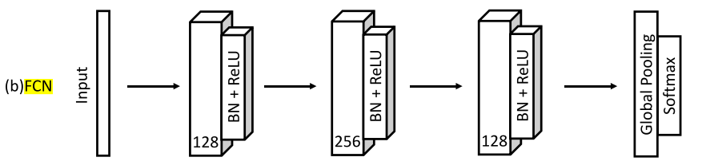

# Description
Fully Convolutional Network (FCN) was proposed in a paper [1]. FCN's architecture is shown in the figure below. \


This repository offers a supervised-training code of FCN on all the subset datasets of the UCR archive. 
The datasets are automatically downloaded when relevant codes are executed. They, also, can be manually downloaded [here](https://figshare.com/articles/dataset/UCR_Archive_2018/21359775).
The trained FCN will be used to compute the FID (Fréchet Inception Distance) score for evaluation of generated time series.

This repository is a part of our paper ["Vector Quantized Time Series Generation with a Bidirectional Prior Model", AISTATS 2023](https://arxiv.org/abs/2303.04743). There has been a lack of proper evaluation protocol to measure quality of generated samples in the time series generation (TSG) literature. 
Traditionally, visual inspection of PCA and t-SNE mapping of generated samples have been used. In the paper, we propose to use Fréchet inception distance (FID) score and Inception Score (IS), following the evaluation protocol in computer vision. To compute the FID and IS, a pretrained classification model is needed. Unlike the computer vision field, there is no pretrained classification model for time series. Thus, we have trained the FCN models for all the UCR archive datasets and provide the pretrained FCN models here. 
We hope that the follow-up papers in the TSG literature could be better compared with each other via the FID and IS-based evaluation protocol.


# `pip` installation
```python
pip install supervised-fcn
```

# Load a Pretrained FCN 
```python
from supervised_FCN.example_pretrained_model_loading import load_pretrained_FCN

subset_dataset_name = ...  # 'Adiac'
fcn = load_pretrained_FCN(subset_dataset_name)
fcn.eval()
```
You can do the **_forward propagation_** as follows:
```python
x = torch.rand((1, 1, 176))  # (batch_size, in_channels, length)
out = fcn(x)  # (batch_size, n_classes); an output right before the softmax layer.
```
You can obtain the _**representation (feature) vector**_ (_i.e.,_ a vector right after the last pooling layer) as follows:
```python
x = torch.rand((1, 1, 176))  # (batch_size, in_channels, length)
z = fcn(x, return_feature_vector=True)  # (batch_size, feature_dim)
```

# Compute FID and IS
### FID
```python
from supervised_FCN.example_compute_FID import calculate_fid

x_real = torch.rand((1, 1, 176))  # (batch_size, in_channels, length)
x_fake = torch.rand((1, 1, 176))  # (batch_size, in_channels, length)

z_real = fcn(x_real, return_feature_vector=True)  # (batch_size, feature_dim)
z_fake = fcn(x_fake, return_feature_vector=True)  # (batch_size, feature_dim)

fid_score = calculate_fid(z_real.cpu().detach().numpy(), z_fake.cpu().detach().numpy())
```

### IS
```python
from supervised_FCN.example_compute_IS import calculate_inception_score

x = torch.rand((1, 1, 176))  # (batch_size, in_channels, length)
out = fcn(x)  # (batch_size, n_classes); an output right before the softmax layer.
p_yx = torch.nn.functional.softmax(out, dim=-1)  # p(y|x); (batch_size, n_classes)

IS_mean, IS_std = calculate_inception_score(p_yx.cpu().detach().numpy())
```

# Training

## Prerequisite for Training
You need to download the UCR archive dataset and put it in `supervised_FCN/datasets/`. You can download it from [here](https://figshare.com/articles/dataset/UCR_Archive_2018/21359775).
Then, your `supervised_FCN/datasets` directory should have `supervised_FCN/datasets/UCRArchive_2018`.

## Training
`supervised_FCN/train_fcn.py`: runs training of FCN on a subset dataset from the UCR archive.

`supervised_FCN/configs/config.yaml`: is where you can set parameters and hyper-parameters for dataset loading and training. 

# Training History
The training histories of FCN on all the UCR subset datasets are available [here](https://wandb.ai/daesoolee/supervised-FCN?workspace=user-daesoolee).

A training and test dataset split is the same as provided in the UCR archive, and a test dataset is used as a validation set during training for better training progress tracking.

# Optimizer
- initial learning rate: 1e-3
- learning rate scheduler: cosine learning rate scheduler
- optimizer: AdamW
- weight decay: 1e-5
- max epochs: 1000
- batch size: 256

# Example Templates
`supervised_FCN/example_data_loading.py`: a template for loading a subset dataset from the UCR archive.

`supervised_FCN/example_pretrained_model_loading.py`: a template for loading a pretrained FCN.

`supervised_FCN/example_compute_FID.py`: an example of computing the FID score.

`supervised_FCN/example_compute_IS.py`: an example of computing the IS (Inception Score).

# Reference
[1] Wang, Zhiguang, Weizhong Yan, and Tim Oates. "Time series classification from scratch with deep neural networks: A strong baseline." 2017 International joint conference on neural networks (IJCNN). IEEE, 2017.

# Citation
```
@inproceedings{lee2023vector,
  title={Vector Quantized Time Series Generation with a Bidirectional Prior Model},
  author={Lee, Daesoo and Malacarne, Sara and Aune, Erlend},
  booktitle={International Conference on Artificial Intelligence and Statistics},
  pages={7665--7693},
  year={2023},
  organization={PMLR}
}
```
